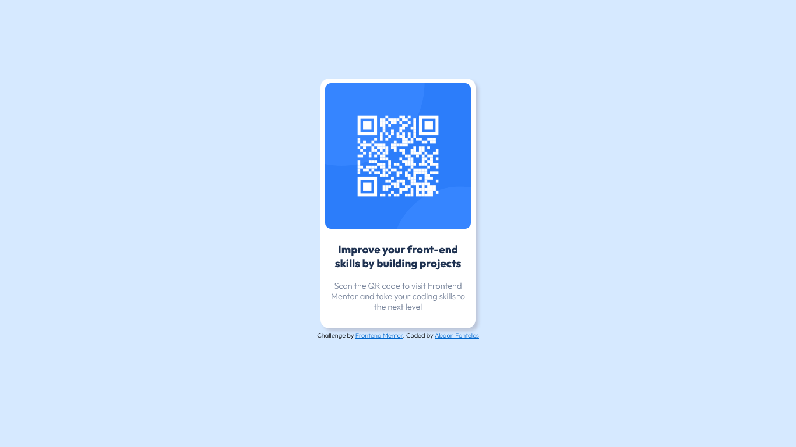

# Frontend Mentor - QR code component solution

This is a solution to the [QR code component challenge on Frontend Mentor](https://www.frontendmentor.io/challenges/qr-code-component-iux_sIO_H). Frontend Mentor challenges help you improve your coding skills by building realistic projects. 

## Table of contents

- [Overview](#overview)
  - [Screenshot](#screenshot)
  - [Links](#links)
- [My process](#my-process)
  - [Built with](#built-with)
  - [What I learned](#what-i-learned)
  - [Continued development](#continued-development)
  - [Useful resources](#useful-resources)
- [Author](#author)
- [Acknowledgments](#acknowledgments)


## Overview

### Screenshot




### Links

- Solution URL: [Click here](https://github.com/Abdon-Fonteles/qrcode/blob/b56e2baa8b6082e6b35a93a11058a544e8823c9e/index.html)
- Live Site URL: [Click here](https://Abdon-Fonteles.github.io/qrcodecomponent/)


## My process

### Built with

- Semantic HTML5 markup
- CSS custom properties


### What I learned

I learned a lot about fonts, as well as how to position a background (qr code background), box-shadow and css customizations.

Some codes:

```html
  <link rel="preconnect" href="https://fonts.googleapis.com">
  <link rel="preconnect" href="https://fonts.gstatic.com" crossorigin>
  <link href="https://fonts.googleapis.com/css2?family=Outfit:wght@300;800&display=swap" rel="stylesheet">
```
```css
#background {
  box-shadow: 5px 5px 5px #BDC6D9;
}
```


### Continued development

I will continue to improve myself in html and css and start bootstrap and javascript.

### Useful resources

- [GitHub](https://www.github.com) - I don't even know what to say about GitHub, because it helps a lot in development, from writing the site to hosting it. I really liked it and will be using it a lot from now on.
- [Google Fonts](https://fonts.google.com/) - This is an amazing site that helped me find fonts of all styles. I highly recommend.
- [W3Schools](https://www.w3schools.com/) - This is an amazing site that helped me find everything about html and css. I recommend it to anyone who is still learning programming.


## Author

- GitHub - [@Abdon-Fonteles](https://www.github.com/abdon-fonteles)
- Frontend Mentor - [@abdon-fonteles](https://www.frontendmentor.io/profile/abdon-fonteles)
- Twitter - [@AbdonFonteles1](https://www.twitter.com/AbdonFonteles1)


## Acknowledgments

I'm new to programming, and finding the frontend mentor was really amazing. This was my first challenge, I did it alone, searching and learning. I know I still have a lot to learn, but I won't give up on this journey.

